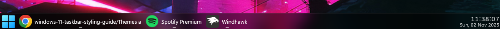

# TintedGlass theme for Windows 11 Taskbar Styler

**Author**: [TheRealCisWhiteMale](https://github.com/TheRealCisWhiteMale)
**Contributor**: [benjaminfberger](https://github.com/benjaminfberger)



## Notes
* This taskbar theme is designed to be used in dark mode.
* If you would like the System Tray to be qr code glyph to match [TaskbarXII theme for Windows 11 Taskbar Styler](https://github.com/ramensoftware/windows-11-taskbar-styling-guide/blob/main/Themes/TaskbarXII/README.md) add this at the end of the settings.


<details>
<summary>Click to expand mod settings</summary>

```yaml
  - target: TextBlock#InnerTextBlock[Text=]
    styles:
      - Text=
```
</details>

---

## Required Windhawk Mods for similar results
To achieve similar results, install and configure the following Windhawk mods in addition to Windows 11 Taskbar Styler:

- Taskbar Clock Customization – for styling the clock. You will need to add your weather location if you have the desire to use that function and may need to change date formatting if you wish.

<details>
<summary>Click to expand mod settings</summary>

```yaml
ShowSeconds: 1
TimeFormat: HH':'mm':'ss
DateFormat: ddd',' dd MMM yyyy
DateLocale: ''
WeekdayFormat: custom
WeekdayFormatCustom: Mon, Tue, Wed, Thu, Fri, Sat, Sun
TopLine: '%time%'
BottomLine: '%date%'
MiddleLine: '%weekday%'
TooltipLine: '%weather%'
TooltipLineMode: replace
Width: 180
Height: 60
MaxWidth: 0
TextSpacing: -4
DataCollection:
  NetworkMetricsFormat: mbs
  NetworkMetricsFixedDecimals: -1
  DiskMetricsFormat: sameAsNetwork
  DiskMetricsFixedDecimals: -1
  PercentageFormat: spacePaddingAndSymbol
  UpdateInterval: 1
  NetworkAdapterName: ''
  GpuAdapterName: ''
MediaPlayer:
  IgnoredPlayers:
    - ''
  MaxLength: 0
  MediaInfoFormat: '%media_artist% - %media_title%'
  NoMediaText: No media
  RemoveBrackets: 0
WebContentWeatherLocation: (insert your city here)
WebContentWeatherFormat: '%c 🌡️%t 🌬️%w'
WebContentWeatherUnits: autoDetect
WebContentsItems:
  - Url: https://rss.nytimes.com/services/xml/rss/nyt/World.xml
    BlockStart: <item>
    Start: <title>
    End: </title>
    ContentMode: xmlHtml
    SearchReplace:
      - Search: ''
        Replace: ''
    MaxLength: 28
WebContentsUpdateInterval: 10
TimeZones:
  - GMT Standard Time
TimeStyle:
  Hidden: 0
  TextColor: ''
  TextAlignment: Right
  FontSize: 16
  FontFamily: ''
  FontWeight: Medium
  FontStyle: ''
  FontStretch: ''
  CharacterSpacing: 70
  LineHeight: 0
DateStyle:
  Hidden: 0
  TextColor: ''
  TextAlignment: Right
  FontSize: 12
  FontFamily: ''
  FontWeight: ''
  FontStyle: ''
  FontStretch: ''
  CharacterSpacing: 0
  LineHeight: 0
oldTaskbarOnWin11: 0
DataCollectionUpdateInterval: 1
```
</details>

---

- Taskbar Height and Icon Size

<details>
<summary>Click to expand mod settings</summary>

```yaml
TaskbarHeight: 40
IconSize: 32
TaskbarButtonWidth: 40
IconSizeSmall: 16
TaskbarButtonWidthSmall: 32
```
</details>

---

- Taskbar Labels for Windows 11

<details>
<summary>Click to expand mod settings</summary>

```yaml
mode: labelsWithoutCombining
taskbarItemWidth: 0
runningIndicatorStyle: centerFixed
progressIndicatorStyle: sameAsRunningIndicatorStyle
excludedPrograms:
  - ''
minimumTaskbarItemWidth: 43
maximumTaskbarItemWidth: 300
fontSize: 13
fontFamily: ''
textTrimming: clip
leftAndRightPaddingSize: 6
spaceBetweenIconAndLabel: 6
runningIndicatorHeight: 0
runningIndicatorVerticalOffset: 0
alwaysShowThumbnailLabels: 0
labelForSingleItem: '%name%'
labelForMultipleItems: '[%amount%] %name%'
```
</details>

---

## Suggested Windhawk mods for full theme continuity
To achieve the full look, install and configure the following Windhawk mods in addition to Windows 11 Taskbar Styler:

- Windows 11 Start Menu Styler

[TintedGlass theme for Windows 11 Start Menu Styler](https://github.com/ramensoftware/windows-11-start-menu-styling-guide/blob/main/Themes/TintedGlass/README.md).

---

- Windows 11 Notification Center Styler

[TintedGlass theme for Windows 11 Notification Center Styler](https://github.com/ramensoftware/windows-11-notification-center-styling-guide/blob/main/Themes/TintedGlass/README.md).

---

- Windows 11 File Explorer Styler

[TintedGlass theme for Windows 11 File Explorer Styler](https://github.com/ramensoftware/windows-11-file-explorer-styling-guide/blob/main/Themes/TintedGlass/README.md).

---

- Translucent Windows

<details>
<summary>Click to expand mod settings</summary>

```yaml
RenderingMod:
  ThemeBackground: 1
  SysColors: 1
  AccentColorControls: 1
  TextAlphaBlend: 1
BackgroundEffects:
  type: acrylicblur
  AccentBlurBehind: '80000000'
FlyoutsEffects: 0
RuledPrograms:
  - target: notepad.exe
    RenderingMod:
      ThemeBackground: 1
      AccentColorControls: 1
    BackgroundEffects:
      type: ''
      AccentBlurBehind: ''
    AccentBlurBehind: '80000000'
    BorderColor:
      ColorBorder: 0
      RainbowBorder: 0
      borderstyles_active: '000000'
      borderstyles_inactive: '000000'
    CornerOption: smallround
    ExtendFrame: 0
    ImmersiveDarkTitle: 1
    RainbowSpeed: 1
    TitlebarColor:
      ColorTitlebar: 0
      RainbowTitlebar: 0
      titlerbarstyles_active: FF0000
      titlerbarstyles_inactive: 00FFFF
    TitlebarTextColor:
      ColorTitlebarText: 0
      RainbowTextColor: 0
      titlerbarcolorstyles_active: FFFFFF
      titlerbarcolorstyles_inactive: FFFFFF
    type: acrylicsystem
  - target: notepad++.exe
    RenderingMod:
      ThemeBackground: 1
      AccentColorControls: 1
    BackgroundEffects:
      type: ''
      AccentBlurBehind: ''
    AccentBlurBehind: '80000000'
    BorderColor:
      ColorBorder: 0
      borderstyles_active: '0'
      borderstyles_inactive: '0'
    CornerOption: smallround
    ExtendFrame: 0
    ImmersiveDarkTitle: 1
    TitlebarTextColor:
      ColorTitlebarText: 0
      titlerbarcolorstyles_active: FFFFFF
      titlerbarcolorstyles_inactive: FFFFFF
    type: acrylicsystem
  - target: chrome.exe
    RenderingMod:
      ThemeBackground: 1
      AccentColorControls: 1
    BackgroundEffects:
      type: ''
      AccentBlurBehind: ''
    AccentBlurBehind: '80000000'
    BorderColor:
      borderstyles_active: '000000'
      borderstyles_inactive: '000000'
      ColorBorder: 0
    CornerOption: smallround
    ExtendFrame: 1
    ImmersiveDarkTitle: 1
    type: acrylicblur
  - target: vlc.exe
    RenderingMod:
      ThemeBackground: 1
      AccentColorControls: 1
    BackgroundEffects:
      type: none
      AccentBlurBehind: ''
AccentBlurBehind: '80000000'
BorderColor:
  ColorBorder: 0
  RainbowBorder: 0
  borderstyles_active: '0'
  borderstyles_inactive: '0'
  MenuBorderColor: 1
CornerOption: smallround
ExtendFrame: 1
ImmersiveDarkTitle: 1
RainbowSpeed: 1
TitlebarColor:
  ColorTitlebar: 0
  RainbowTitlebar: 0
  titlerbarstyles_active: '0'
  titlerbarstyles_inactive: '0'
TitlebarTextColor:
  ColorTitlebarText: 1
  RainbowTextColor: 0
  titlerbarcolorstyles_active: FFFFFF
  titlerbarcolorstyles_inactive: FFFFFF
type: acrylicblur
```
</details>

---

- Win32 UI Modernizer

<details>
<summary>Click to expand mod settings</summary>

```yaml
TreeViewSection:
  Enabled: 1
  ModernInsertMark: 1
  InsertMarkColor: accent
  RemoveTreeLines: 1
  AnimatedArrows: 0
GeneralSection:
  Enabled: 1
  CustomAccentColor: ''
  TransparencyCompat: 1
  ModernTooltips: 1
  ModernLightScrollbars: 1
  DisableTextPipeline: 1
  EnableDarkMode: 1
  ModernContextMenus: 1
  MenuCornerStyle: smallround
  MenuHoverRadius: 6
  RoundedButtons: 1
  CheckBoxAnim: 1
  AccentRadioButtons: 1
  EditFocusLine: 1
  ModernGroupBox: 1
  ModernSeparators: 1
  ModernFocusRect: hidden
  ProgressBars: 1
  RoundedTabPane: 1
  NormalizeDragDrop: 1
  TabPill: 1
ExplorerSection:
  Enabled: 1
  AccentColorize: 1
  AccentMarquee: 1
  RoundedSelection: 1
  NavPaneHoverFade: 1
  NeutralSelection: 0
  RemoveNavDivider: 0
  RemoveNavDividerTW: 1
  NavDividerHoverReveal: 0
  NavPaneWinUIMetrics: 0
  LegacyRebarControls: 1
  RebarMicaTint: 0
  NavPanePill: 1
  NavPillStyle: winui_top
  NavPillGradient: 0
  AccentButtonGradient: 0
  EditFocusGradient: 0
  NavPillNoClip: 1
  ListViewPill: 1
  RoundedGroupHeaders: 1
  FluentPinIcon: 1
  PinIconStyle: outline
  PinIconColor: accent
  PinMarginRight: 10
  GlyphIcons: disabled
  ModernizeShellIcons: 1
  GlyphColor: ''
  DiskChartAccentColor: 1
  AutoPlayReplacement: 1
RegeditSection:
  Enabled: 1
  TransparentBg: 1
  GlyphIcons: 1
WinverSection:
  Enabled: 1
  Background: black
ComboBoxDWMSection:
  Enabled: 1
  CornerStyle: small
DarkModeExcludeList:
  - target: ''
```
</details>

---

## Theme selection

The theme is integrated into the mod and can be selected directly from the mod's
settings:

* Open the Windows 11 Taskbar Styler mod in Windhawk.
* Go to the "Settings" tab.
* Select the theme and save the settings.

## Manual installation

The theme styles can also be imported manually. To do that, follow these steps:

* Open the Windows 11 Taskbar Styler mod in Windhawk.
* Go to the "Settings" tab and select "Textual mode".
* Copy the content below to the text box and click "Save settings".

<details>
<summary>Content to import (click to expand)</summary>

```yaml
styleConstants:
  - CommonBgBrush=<WindhawkBlur BlurAmount="18" TintColor="#80000000"/>
controlStyles:
  - target: Taskbar.TaskbarFrame > Grid#RootGrid > Taskbar.TaskbarBackground > Grid > Rectangle#BackgroundFill
    styles:
      - Fill:=$CommonBgBrush
  - target: Taskbar.TaskbarBackground#HoverFlyoutBackgroundControl > Grid > Rectangle#BackgroundFill
    styles:
      - Fill:=$CommonBgBrush
											  
		   
				
  - target: WindowsInternal.ComposableShell.Experiences.Switcher.AltTab > Windows.UI.Xaml.Controls.Grid#ModalRootGrid > Windows.UI.Xaml.Controls.Border#BackgroundElement
    styles:
      - Background=Transparent
  - target: WindowsInternal.ComposableShell.Experiences.Switcher.AltTab > Windows.UI.Xaml.Controls.Grid#ModalRootGrid > Windows.UI.Xaml.Controls.Border#BackgroundElement > WindowsInternal.ComposableShell.Experiences.Switcher.SwitchItemList
    styles:
      - Background:=$CommonBgBrush
  - target: Windows.UI.Xaml.Controls.Border#BackgroundDimmingLayer
    styles:
      - Background:=$CommonBgBrush
  - target: MenuFlyoutPresenter > Border
    styles:
      - Fill:=$CommonBgBrush
      - BorderThickness=0,0,0,0
      - CornerRadius=14
      - Padding=2,2,2,2
  - target: Border#OverflowFlyoutBackgroundBorder
    styles:
      - Fill:=$CommonBgBrush
      - BorderThickness=0,0,0,0
      - CornerRadius=14
      - Margin=-2,-2,-2,-2
  - target: SystemTray.AdaptiveTextBlock#Base > TextBlock#InnerTextBlock
    styles:
      - FontSize=18
  - target: SystemTray.ImageIconContent > Grid#ContainerGrid > Image
    styles:
      - Width=18
      - Height=18
  - target: Grid#IconPanel, Taskbar.TaskListLabeledButtonPanel#IconPanel
    styles:
      - Padding=2,2,2,2
  - target: Taskbar.TaskListButtonPanel#ExperienceToggleButtonRootPanel
    styles:
      - Padding=2,2,2,2
  - target: Grid#ContainerGrid
    styles:
      - Padding=2,2,2,2
  - target: Taskbar.FlyoutFrame > Canvas#HoverFlyoutCanvas > Grid#HoverFlyoutGrid
    styles:
      - Padding=2,2,2,2
  - target: Image#Icon
    styles:
      - Margin=2,2,2,2
  - target: Rectangle#BackgroundStroke
    styles:
      - Fill:=<WindhawkBlur BlurAmount="18" TintColor="#1AFFFFFF"/>
  - target: Grid#OverflowRootGrid > Border
    styles:
      - Background:=$CommonBgBrush
  - target: Grid#ConfirmatorMainGrid
    styles:
      - Background:=$CommonBgBrush
      - BorderThickness=0
  - target: WindowsInternal.ComposableShell.Experiences.TextInput.Common.InputSwitcher > ContentControl > ContentPresenter > Grid
    styles:
      - Background:=$CommonBgBrush
      - BorderThickness=0
  - target: WindowsInternal.ComposableShell.Experiences.TextInput.Common.InputSwitcher > ContentControl > ContentPresenter > Grid > Grid
    styles:
      - Fill:=<WindhawkBlur BlurAmount="18" TintColor="#1AFFFFFF"/>
```
</details>
